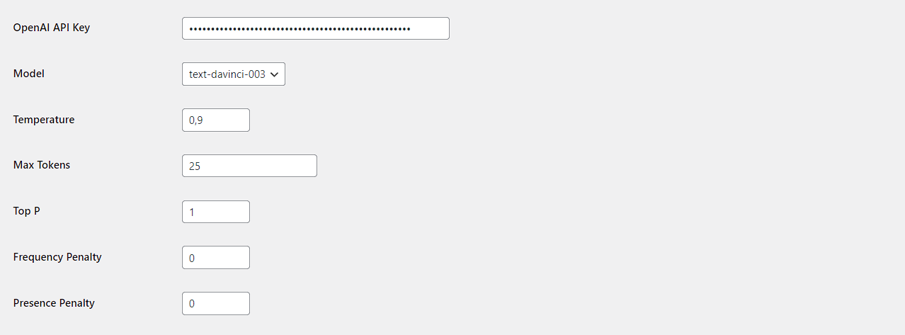

# CommentorAI: Manage user comments and reply with AI on your wordpress site

Comments Reply with GPT (OpenAI) is a plugin that uses OpenAI's GPT to automatically reply to comments on your WordPress website. This plugin adds a "Reply with WPWM OpenAI" button to each comment's actions, which, when clicked, sends the comment text to OpenAI's ChatGPT API and returns a suggested response.

## Jump straight to:
- [Installation](#installation)
- [Plugin Options and Settings](#plugin-options-and-settings)
- [Screenshots](#screenshots)

## Installation

1. Upload the plugin files to the `/wp-content/plugins/WordPress-ChatGPT-Comments-Reply/core.php` directory, or install the plugin directly through the WordPress plugins screen.
2. Activate the plugin from the 'Plugins' screen in WordPress.
3. Go to the Settings->Plugin Settings screen to configure the plugin. You will need to provide your OpenAI API key to use the plugin.
4. Use the "Reply with A.I." button to generate automatic replies to comments on your WordPress site.

## Plugin Options and Settings

You can configure the following settings in the plugin:

- OpenAI API Key: Enter your OpenAI API key to use the plugin.
- Model: The default model is 'gpt-3.5-turbo' (best cost to benefit ratio according to my tests).
- Temperature: Set the temperature parameter to control the creativity of the generated replies. The default temperature is 0.9.
- Max Tokens: Set the maximum number of tokens to generate for the reply. The default value is 100.
- Top P: Set the top-p parameter to control the diversity of the generated replies. The default value is 1.
- Frequency Penalty: Set the frequency penalty parameter to control the likelihood of the same word being repeated in the generated replies. The default value is 0.0.
- Presence Penalty: Set the presence penalty parameter to control the likelihood of new words being introduced in the generated replies. The default value is 0.0.

### Screenshots
##### Option-Page

